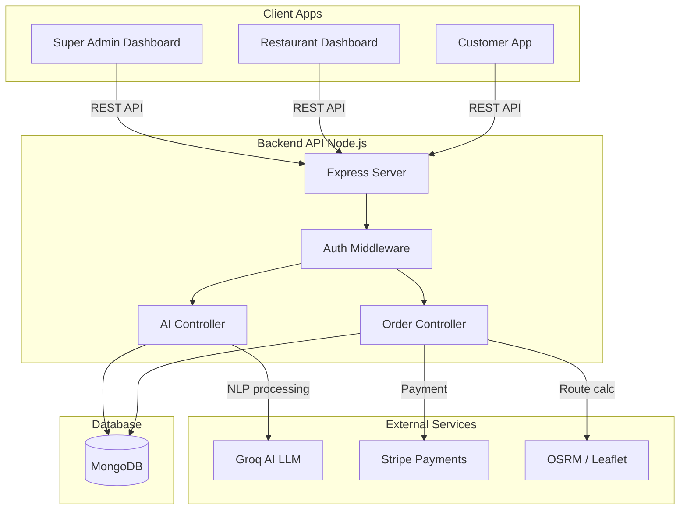
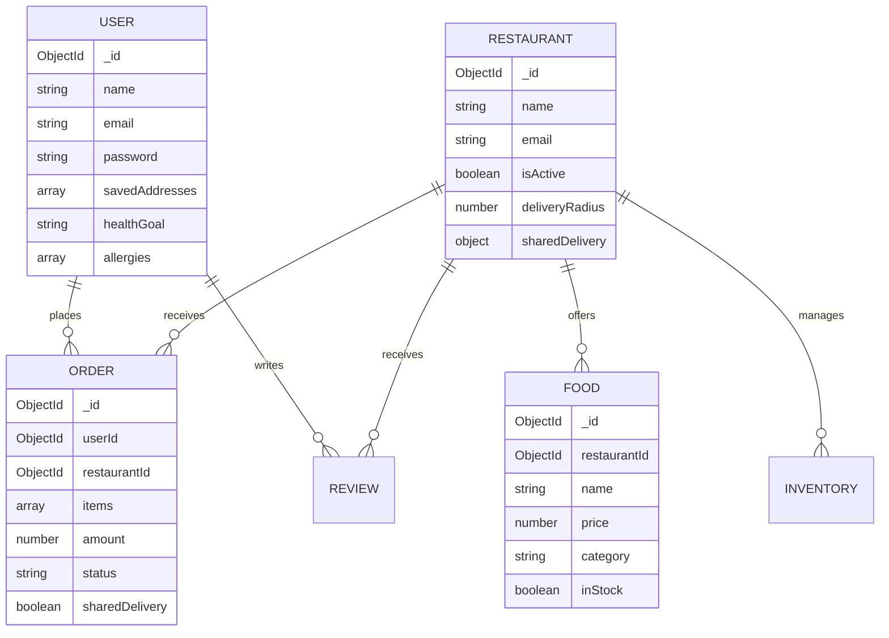
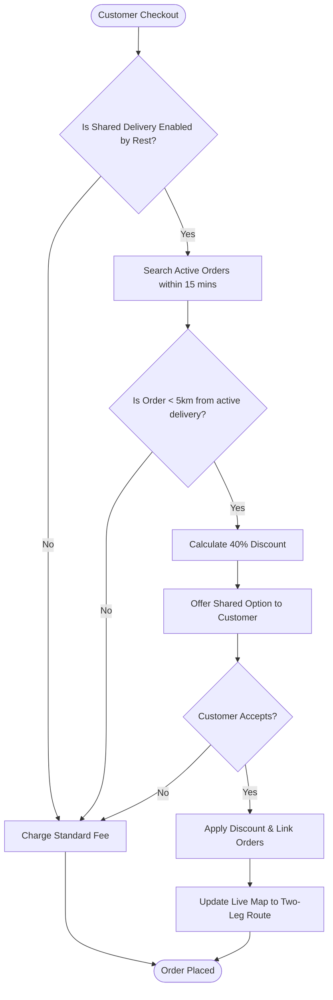

# Crave: AI-Powered Food Delivery Platform
**Final Year Project Report**

## 1. Problem Statement
The current food delivery landscape is dominated by platforms that prioritize individual convenience at the expense of high delivery fees and environmental impact. Customers face soaring costs, while restaurants struggle with high commission rates and inefficient logistics. Furthermore, traditional discovery mechanics are static, relying on basic text search rather than contextual or emotional user needs (e.g., mood-based dining). Finally, smaller restaurants lack the data analytics tools needed to optimize labor, inventory, and marketing.

## 2. Objectives
- **Cost Reduction via Logistics Optimization:** Implement a Shared Delivery algorithm that groups geographically and temporally proximate orders to reduce delivery costs.
- **Contextual Discovery:** Integrate Large Language Models (LLMs) to allow customers to discover food based on natural language, mood, and dietary goals.
- **Restaurant Empowerment:** Provide a robust dashboard for restaurants to manage inventory, track AI-summarized sentiment from reviews, and dynamically toggle flash deals.
- **Seamless Multi-Tenant Architecture:** Ensure secure, scalable separation of concerns among Customers, Restaurant Admins, and Super Admins.

## 3. Literature & Market Comparison
| Feature | UberEats / Deliveroo | Crave (Proposed) |
| :--- | :--- | :--- |
| **Delivery Cost** | Fixed or distance-based, high | Dynamic shared delivery discounts |
| **Search** | Keyword & Category | AI-Powered Semantic & Mood Search |
| **Restaurant Analytics** | Basic revenue & order count | AI Review Summaries, Surge Detection |
| **Customer Insights** | Basic past orders | AI Health-Sync (Allergy & Goal filtering) |

## 4. Methodology
The project follows an Agile development methodology, separated into 3 main applications using a unified backend.
- **Frontend (Customer App):** React.js + Vite, TailwindCSS, Leaflet Maps.
- **Backend (API):** Node.js + Express, MongoDB (Mongoose), JWT Auth.
- **Restaurant Admin App:** React.js dashboard for inventory, orders, and AI analytics.
- **Super Admin App:** React.js centralized oversight.
- **AI Integration:** Groq API running Llama-3.1-8b for low-latency NLP tasks.

## 5. Architecture Diagrams

### 5.1 System Architecture

### 5.2 Database ERD

### 5.3 Shared Delivery Algorithm

## 6. AI Features (Academic Breakdown)
Crave integrates AI not as a gimmick, but as a core functional utility. 

**What the AI does:**
1. **Semantic Search & NLP:** Converts natural language queries ("healthy spicy food under 30") into strict JSON parameters (dietary: ["healthy", "spicy"], maxPrice: 30) to query the database.
2. **Review Summarization:** Condenses dozens of unstructured textual reviews into structured Positive/Negative themes using zero-shot prompting.
3. **Health-Sync:** Cross-references user allergy/goal profiles against food descriptions to score compatibility and flag dangers.

**Inputs/Outputs:**
- *Input:* User prompt + Context (User's past orders or restaurant menu JSON slice).
- *Output:* Strictly validated JSON objects parsing sentiments or ranks.

**Limitations & Fallback Behavior:**
- *Latency Limit:* LLM calls add ~500-800ms of latency.
- *Hallucination Guard:* The AI is strictly prompted to return JSON; its output is validated against database IDs. If it hallucinated an ID, the backend strips it out.
- *API Missing/Down Fallback:* If the `GROQ_API_KEY` is missing or the external API is unreachable, the system gracefully falls back to deterministic regex matching, basic keyword searches, and statistical averages (e.g., for reviews), ensuring 100% platform uptime.

## 7. Testing Results
- **Unit Tests:** Validated inventory deduction logic ensuring stock never drops below 0.
- **Integration Tests:** Verified the Order Controller correctly applies distance constraints for shared delivery matching.
- **Security Tests:** Auth routes validated for proper JWT generation, bcrypt hashing, and Joi input sanitization.

## 8. Limitations & Future Work
- **Limitation:** OSRM routing is currently point-to-point and lacks live traffic data.
- **Limitation:** AI context windows prevent sending entire restaurant menus at once; we currently use chunking/sampling.
- **Future Work:** Implement driver apps for real-time GPS streaming. Integrate Redis for caching frequent AI queries to reduce Groq API calls.
